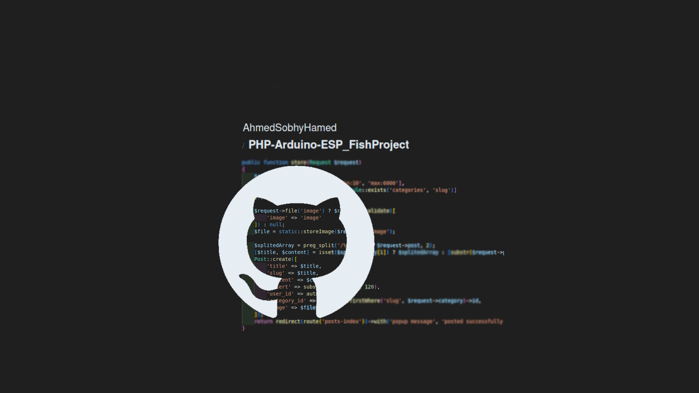
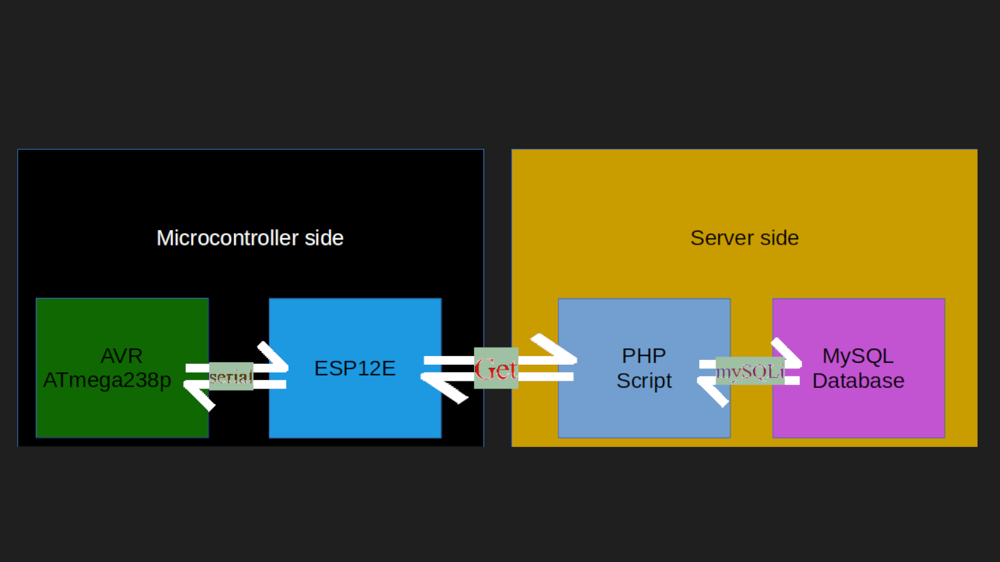

# PHP-Arduino-ESP_FishProject

Project made to control, monitor, and store data for a small-scale aquaculture farm.

## Table of Contents

- [Introduction](#introduction)
- [Features](#features)
- [Installation](#installation)
- [Usage](#usage)
- [Technologies Used](#technologies-used)
- [Project Structure](#project-structure)
- [License](#license)
- [Contact](#contact)

  <!-- intro -->

## Introduction

 
IoT project with a vanilla PHP script for the server, and AVR Atmega328p and ESP12E as hardware microcontrollers. It creates a system that controls the amount of feed, feeding times, Light turn on/off and heater turn on/pff, monitors and stores data for temperature, EC, and pH, and provides manual control for the system.  
 
This project is separated into two major sections: the first is the server-side project, and the second is the microcontroller program.
<be>
This is my first PHP project built from scratch, so you will find a lot of duplication, messy code, and potential security threats.

  <!-- usage or how to interact with this technologies like api end points and what they do -->

## Usage

**[see an example for user interaction.[video]](http://youtube.com)**

## Technologies Used

- languages:

  - PHP
  - mysql
  - HTML 5.
  - CSS.
  - C++

- framworks and Libraries:

  - mysqli
  - Arduino
  - ESP8266
  - OneWire
  - DallasTemperature

    <!-- about the project and a digram of how it work -->

## Project Structure

#### AVR Project:

- FishController_withYasser

  - arv
    - avr.ino
    - Cleaner.h
    - Data.h
    - feeder.h
    - Heater.h
    - light.h
    - Order.h
    - register.h

#### ESP Project:

- FishController_withYasser

  - esp
    - esp.ino
    - Order.h
    - Request.h

#### PHP Project:

- FishWebsite_withYasser

  - index.php
  - 

  - 

  - lib/button.php
  - lib/form.php
  - 

  - 

  - logindata.php
  - manoDB.php
  - 

  - confirm.php
  - device.php
  - start.php
  - 

  - main.php
  - calib.php
  - cali_redirect.php
  - maiual.php
  - settings.php
  - settings_redirect.php
  - data.php
  - 

  - 

  - testingFile.php

## Project Hardware Images

1
1
1
1
1
1
1
1
1
1
1
1

  <!-- licance -->

## License

This project is licensed under the MIT License - see the [LICENSE](/LICENSE) file for details

  <!-- contacts -->

## Contact

Created by [Ahmed Sobhy]:

- email: [ahmed.s.abdulaal@gmail.com](mailto:ahmed.s.abdulaal@gmail.com)
- linkedin: [Ahmed Sobhy](https://www.linkedin.com/in/ahmed-sobhy-b824b7201/)
   
  feel free to contact me!
